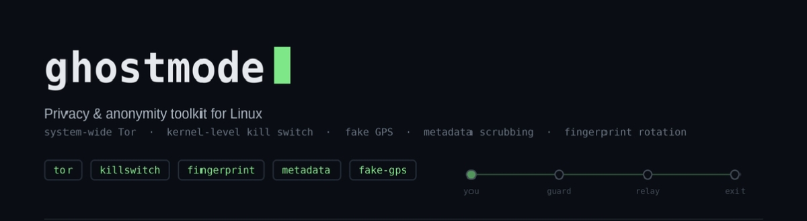
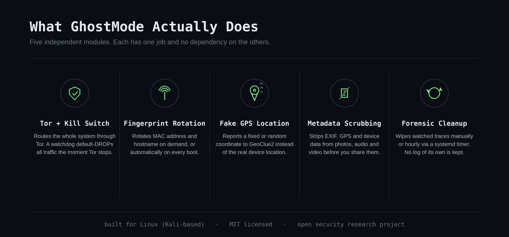
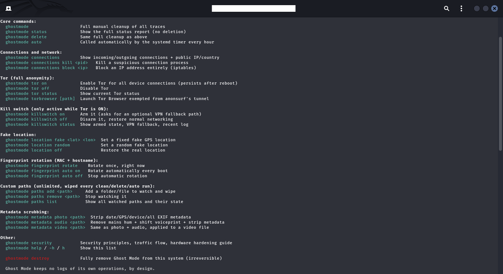

<p align="center">
  
</p>

<p align="center">
  
  
  
  
</p>

# GhostMode V2.0

**A command-line privacy and anonymity toolkit for Linux.**

GhostMode wipes forensic traces, routes your whole system through Tor with a real kill switch, fakes your GPS location, rotates your network fingerprint, scrubs metadata from your files, and gives you one command (`ghostmode security`) that teaches the security principles behind all of it — no prior security background required.

It is built for one goal: **close the gap between "I installed a privacy tool" and "I actually understand what my computer is doing on the network."** Regular users shouldn't need a security background to get a professional-grade privacy posture. GhostMode tries to make that gap as small as a terminal command.

This is an open security research project. It is not a finished product and never claims to be "unhackable" or "100% anonymous" — no tool can honestly claim that. It documents its own limits (see [Honest Limitations](#honest-limitations)) because a privacy tool that oversells itself is more dangerous than one that doesn't exist.

---

## Table of Contents

- [Overview](#overview)
- [Who this is for](#who-this-is-for)
- [Installation](#installation)
- [Command Reference](#command-reference)
- [Preview](#preview)
- [How Your Traffic Actually Flows](#how-your-traffic-actually-flows)
- [Architecture](#architecture)
- [Honest Limitations](#honest-limitations)
- [Roadmap](#roadmap)
- [Contributing](#contributing)
- [License](#license)

---

## Overview

<p align="center">
  
</p>

---

## Who this is for

Anyone who wants their Linux machine to leak less — journalists, researchers, activists, or anyone who just doesn't think their ISP, router, or every app on their laptop needs to know everything about them. It was built and tested on **Kali Linux**, but the underlying tools (`systemd`, `iptables`, Tor, `ffmpeg`, `exiftool`) exist on virtually every Debian-based distribution, so it is reasonably portable with minor adjustments.

It is **not** built for attacking other people's systems. It protects the device it's installed on; it does not help compromise anyone else's.

---

## Installation

Works on **any Debian/Kali-based machine** — nothing in the installer is tied to a specific username, hostname, or hardware. Every credential and path is supplied by you at install time.

```bash
git clone https://github.com/compartmentalization/ghostmode.git
cd ghostmode
chmod +x install.sh
./install.sh
```

The installer is interactive and runs in 9 steps:

1. Checks and installs missing dependencies (`curl`, `iproute2`, `iptables`, `pciutils`)
2. Installs GhostMode (copies `bin/` and `lib/` to `~/.local/`, substituting your username and sudo password into the installed copy only — **your source checkout is never modified**)
3. Installs the auto-cleanup `systemd` timer (power-saving settings: low priority, CPU-capped, runs hourly)
4. Enables and starts the timer
5. Enables `systemd` lingering (so scheduled tasks run even without an active login session)
6. Disables zsh's "show previous commands as you type" autosuggestion feature (a minor but real info-leak on a shared or observed screen)
7. Optionally enables Tor for all device connections right away
8. Optionally adds `ghostmode`/`gs` shell aliases
9. Runs a smoke test, then offers to delete the source checkout — **the installed copy is fully independent of it** (verified: `bin/ghostmode` has zero references back to the install directory)

Re-running `install.sh` on an existing install **updates it in place** — your saved state (Tor on/off, custom paths, kill switch config) is preserved, and if Tor was already on, it gets re-armed with whatever fixes shipped since.

No config file to hand-edit, no hardcoded paths to find and change. Everything above happens through the interactive prompts.

---

## Command Reference

```
ghostmode                          Full manual cleanup of all traces
ghostmode status                   Full status report (nothing is deleted)
ghostmode delete                   Same full cleanup, used as an explicit "wipe everything now"
ghostmode auto                     Called automatically by the systemd timer every hour

ghostmode connections              Incoming/outgoing connections + public IP/country
ghostmode connections kill <pid>   Kill a suspicious connection's process
ghostmode connections block <ip>   Block an IP entirely (iptables)

ghostmode tor on                   Tor for all device connections (persists across reboots)
ghostmode tor off                  Disable Tor
ghostmode tor status               Current Tor status
ghostmode torbrowser [path]        Launch Tor Browser exempted from the system-wide tunnel
                                    (prevents Tor-inside-Tor connection failures)

ghostmode killswitch on            Arm the kill switch (optionally asks for a VPN fallback)
ghostmode killswitch off           Disarm it, restore normal networking
ghostmode killswitch status        Armed state, VPN fallback path, watchdog status

ghostmode location fake <lat> <lon>  Fixed fake GPS location (via GeoClue2)
ghostmode location random            Random fake location
ghostmode location off               Restore the real location

ghostmode fingerprint rotate       Rotate MAC address + hostname once, right now
ghostmode fingerprint auto on      Rotate both automatically on every boot
ghostmode fingerprint auto off     Stop automatic rotation

ghostmode metadata photo <path>    Strip capture date, GPS, camera/device info, all EXIF
ghostmode metadata audio <path>    Remove mains-hum fingerprint + shift voiceprint + strip metadata
ghostmode metadata video <path>    Same as photo + audio, applied to a video file

ghostmode paths add <path>         Watch a folder/file — wiped on every clean/delete/auto run
ghostmode paths remove <path>      Stop watching it
ghostmode paths list               Show all watched paths and their current state

ghostmode security                 Security principles, traffic flow, and hardware-hardening guide
ghostmode destroy                  Fully remove GhostMode from this system (irreversible)
ghostmode help / -h / h            This list
```

A few commands deserve more explanation:

**`ghostmode torbrowser`** exists because of a real architectural conflict: once `tor on` routes your *entire system* through Tor, launching the separate Tor Browser Bundle on top nests Tor inside Tor, breaking its TLS handshake to relays. `torbrowser` runs it as a dedicated, unprivileged system user that's explicitly exempted from the system-wide redirect — it connects to the real Tor network directly instead.

**`ghostmode killswitch`** only enforces while Tor is meant to be on. In double-protection mode (the default), it does not distinguish between Tor crashing and you running `tor off` manually — either way, your internet stays cut until you explicitly run `killswitch off`. This is intentional: see [How Your Traffic Actually Flows](#how-your-traffic-actually-flows) for why.

**`ghostmode destroy`** requires typing `DESTROY` in full, not `y/n` — this is deliberately harder to trigger by accident than anything else in the tool.

GhostMode keeps **no logs of its own operations**, by design. There is no audit trail of what was cleaned or when, anywhere — including in `systemd`'s own journal (output from the hourly timer is discarded, not journaled). The tradeoff is explicit: a privacy tool that logs its own cleanup activity has created a new trace of exactly what it was hiding.

---

## Preview

`ghostmode help` in the terminal:

<p align="center">
  
</p>

---

## How Your Traffic Actually Flows

This is the part most privacy tools skip. Here is exactly what changes, and doesn't, when you turn Tor and the kill switch on — using the kill switch's core job (stopping an IP leak to a target site) as the concrete example.

**Baseline, no protection:**

```
Your device → Router → ISP → Internet backbone → Target website
```

Your ISP sees every DNS query, every destination IP, the domain name inside the TLS handshake (SNI), and the timing/volume of your traffic — even though it can't read HTTPS content itself.

**With `ghostmode tor on` (anonsurf, system-wide):**

```
Your device → Router → ISP (sees only "connecting to Tor") → Guard relay → Middle relay → Exit relay → Target website
```

All outbound traffic is forced through Tor's local TransPort via an `iptables REDIRECT` rule. No single party (not your ISP, not any one relay) knows both who you are and what you're visiting.

**The gap `killswitch` closes — without it:**

If the Tor process dies unexpectedly while you're mid-session with a target site:
- New connection attempts to the (now-dead) local TransPort typically fail fast — but this is a side effect of nothing listening on that port, not a guarantee.
- Already-established connections live in the kernel's connection-tracking table; depending on exact system state, they do not necessarily terminate cleanly.
- Some applications retry automatically without a proxy as a resilience feature. If that happens here, the retry goes out on your **real IP**, straight to the target site, with no warning.

**With it:**

The watchdog checks every 5 seconds whether Tor is actually running. The moment it isn't:
- It sets `iptables`'s **default OUTPUT policy to DROP** — not a redirect rule, a default-deny at the kernel level. This blocks every outbound packet regardless of what any single application's retry logic tries to do.
- The only exception is loopback, so the local system keeps functioning.
- If a VPN fallback was configured, it attempts to bring that up as a replacement path.
- In double-protection mode, this holds even if **you** are the one who ran `tor off` — the only way back to normal traffic is `killswitch off`, explicitly.

The difference in one sentence: a `REDIRECT` rule assumes the destination is there; a `DROP` policy doesn't need it to be. That's the entire reason the kill switch is a second, independent mechanism instead of just trusting Tor to stay up.

---

## Architecture

```
ghostmode/
├── bin/
│   └── ghostmode          Thin entry point — sources lib/, dispatches to the
│                           requested command. Contains cmd_help and nothing else.
├── lib/
│   ├── 01-globals.sh       Colors, trace-path lists, shared config paths
│   ├── 02-checks.sh        All status-check functions (what cmd_status reports on)
│   ├── 03-clean.sh         The cleaning engine: cmd_status, cmd_clean, cmd_delete
│   ├── 04-connections.sh   ghostmode connections
│   ├── 05-tor.sh           ghostmode tor
│   ├── 06-killswitch.sh    ghostmode killswitch
│   ├── 07-location.sh      ghostmode location
│   ├── 08-fingerprint.sh   ghostmode fingerprint
│   ├── 09-torbrowser.sh    ghostmode torbrowser
│   ├── 10-metadata.sh      ghostmode metadata
│   ├── 11-paths.sh         ghostmode paths
│   ├── 12-destroy.sh       ghostmode destroy
│   └── 13-security.sh      ghostmode security
├── systemd/
│   ├── ghostmode-timer.service   Hourly auto-clean, templated by install.sh
│   └── ghostmode-timer.timer
└── install.sh              The only installer — see Installation above
```

`bin/ghostmode` sources every file in `lib/` and nothing else; it carries no feature logic itself. Each module in `lib/` is independently syntax-checkable and has a single, named responsibility. Persistence (the hourly timer, Tor-on-boot, the kill switch watchdog, fingerprint rotation) runs as **system-level `systemd` units** with an explicit `User=` directive, rather than `--user` units relying on login-session lingering — the latter turned out to be unreliable across reboots in testing, which is why the architecture uses the former.

**Dependencies:** `bash`, `systemd`, `iptables`, `iproute2` (`ip`, `ss`), `curl`, `ffmpeg`, `exiftool` (or `mat2`, auto-detected if present), `tor` (installed automatically via [Und3rf10w/kali-anonsurf](https://github.com/Und3rf10w/kali-anonsurf) on first `tor on`, since it has no official `apt` package), GeoClue2 (ships by default on Kali).

---

## Honest Limitations

A tool that doesn't say what it can't do isn't trustworthy. So:

- **The embedded-credential model is a real tradeoff.** `install.sh` bakes your sudo password into the installed copy of GhostMode so it can run privileged commands non-interactively (for the hourly timer, the kill switch watchdog, etc.). That installed copy is as sensitive as a plaintext password file and should be treated like one — protected by full-disk encryption and ordinary file permissions.
- **Voiceprint/mains-hum scrubbing (`metadata audio`/`video`) significantly reduces matchability. It does not mathematically guarantee it can never be matched by any technique, present or future.** Treat it as a strong layer, not a certainty.
- **`fingerprint rotate` changes your MAC address and hostname — local-network-level identifiers.** It does not touch browser-level fingerprinting (canvas, WebGL, fonts); that's Tor Browser's job, and it already does it.
- **Visual content in photos/videos (faces, recognizable locations) is not something `metadata` can fix.** Metadata scrubbing and content analysis are different problems.
- **No independent security audit has been done on this codebase.** It's been tested by its author and users reporting back, not reviewed by a third party. Treat it accordingly.

---

## Roadmap

Ideas under consideration for future versions — not commitments, not a schedule:

- [ ] Multi-hop chaining (VPN → Tor → VPN) for an additional routing layer
- [ ] `ghostmode audit` — a self-check command that reviews the current config against security best practices and flags drift
- [ ] A dead-man's-switch mode: auto-run `destroy` if the tool isn't "checked in" within a configurable window
- [ ] Pluggable transport support for Tor (for use in networks that actively block Tor traffic)
- [ ] Broader distro support beyond Debian/Kali (Arch, Fedora derivatives)
- [ ] Encrypted, passphrase-protected storage for `ghostmode paths` targets
- [ ] Optional lightweight dashboard/GUI front-end for non-terminal users
- [ ] Hardware security key (e.g. YubiKey) confirmation step for `destroy`

Have an idea, or a different priority order? Open an issue — the list above is a starting point, not a fixed plan.

---

## Contributing

This is an open security research project, and it stays useful only if people who actually use it push back on it. Bug reports, architecture criticism, feature proposals, and pull requests are all genuinely welcome — including "this design decision is wrong and here's why."

If you're not sure where to start: run `ghostmode security` and `ghostmode help`, read [Architecture](#architecture), then open an issue describing what you found or what you'd like to change. See `CONTRIBUTING.md` for the specifics.

## License

MIT — see `LICENSE`. Use it, fork it, audit it, ship it in something else; just carry the license notice along.
